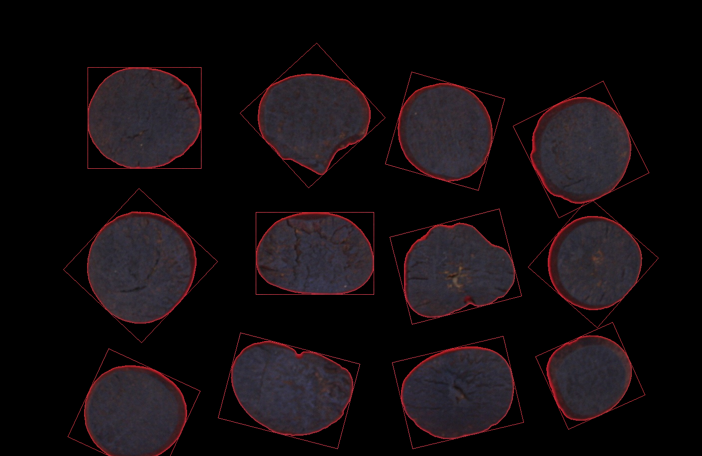
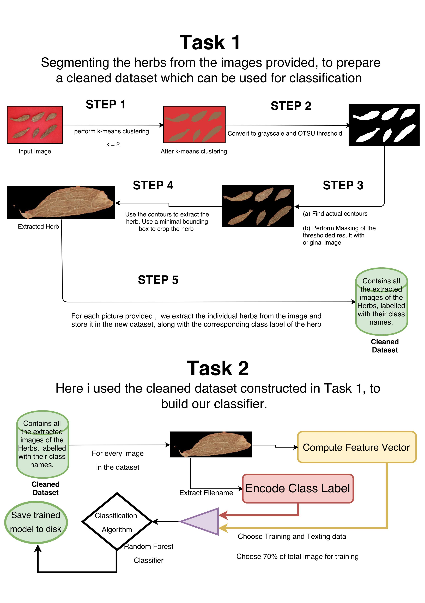
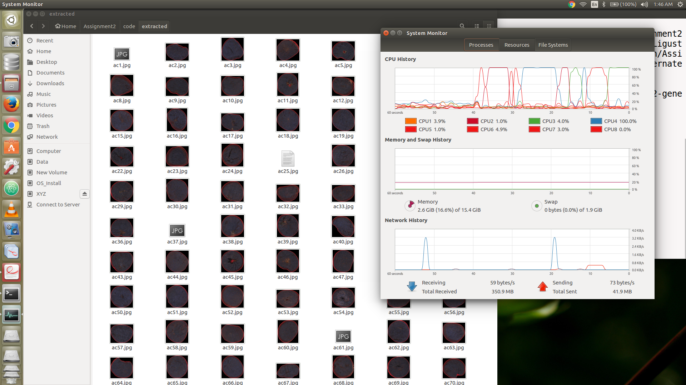
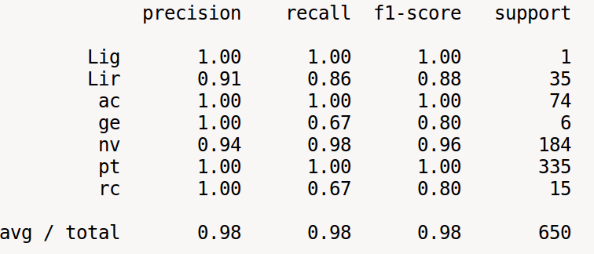
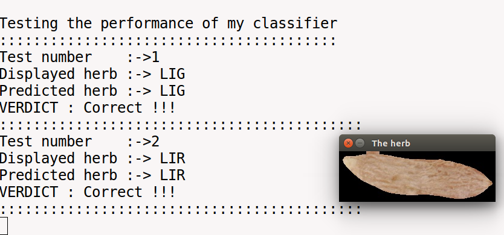

# Traditional Chinese Medicine Classification using Machine Learning


## Dataset : (check the images folder)
## A sample image from the dataset


## Task
The dataset contains pictures of Traditional Chinese Medicine (7 classes).
The objective was to write a good classifier for the given dataset.
**This repo is contains my Assignment(code + documentation) from the course "Computer Vision MM805", which i took as a part of my MSc in Computing Science at University of Alberta**

## Approach
1. Since the dataset pictures donot contain individual Chinese Herb images, we need to first perform segmentation to extract out individual herbs from a given picture.
2. Step 1 is performed for all the images in the dataset.
3. The individual herb images, obtained after performing step 1 is stored in the folder named 'extracted' with filenames corresponding to the respective classname of the herbs. This becomes our new dataset. (Please note: after extracting of individual herbs, you should be having a collection of 2164 images)

*A sample from the constructed dataset is as follows*


## Workflow


## Requirements
1. OpenCV 2.4.11
2. Python 2.7
3. scikit-Learn
4. cPickle

## To run the Scripts follows these steps
cd inside the code folder and execute the commands in the specified order
### 1. First Script

This script will extract individual herbs from all images in the given dataset and construct the new dataset, with the extracted herbs kept inside the 'extracted' folder
```
python start1.py
```
*Snapshot of what the script actually does*


### 2. Sceond Script
This script load the images and labels from the new dataset of herbs we constructed and used trains the images using Random Forest Classifier.
After the classifiaction is done. It chooses 7 images each belonging to different classes, to check how well the classifier works.

```
python herb_classification.py
```
### Output




## Usage (**Please Read Carefully !!**)
TO those who are taking this course, ** please DO NOT copy this content in your assignment** . Instead use this repository as a learning example and try to better your code based on this. You can extend this code and add in your own optimizations that yield a better performance.

## License
MIT License

Copyright (c) 2016 Shrobon Biswas

Permission is hereby granted, free of charge, to any person obtaining a copy
of this software and associated documentation files (the "Software"), to deal
in the Software without restriction, including without limitation the rights
to use, copy, modify, merge, publish, distribute, sublicense, and/or sell
copies of the Software, and to permit persons to whom the Software is
furnished to do so, subject to the following conditions:

The above copyright notice and this permission notice shall be included in all
copies or substantial portions of the Software.

THE SOFTWARE IS PROVIDED "AS IS", WITHOUT WARRANTY OF ANY KIND, EXPRESS OR
IMPLIED, INCLUDING BUT NOT LIMITED TO THE WARRANTIES OF MERCHANTABILITY,
FITNESS FOR A PARTICULAR PURPOSE AND NONINFRINGEMENT. IN NO EVENT SHALL THE
AUTHORS OR COPYRIGHT HOLDERS BE LIABLE FOR ANY CLAIM, DAMAGES OR OTHER
LIABILITY, WHETHER IN AN ACTION OF CONTRACT, TORT OR OTHERWISE, ARISING FROM,
OUT OF OR IN CONNECTION WITH THE SOFTWARE OR THE USE OR OTHER DEALINGS IN THE
SOFTWARE.
